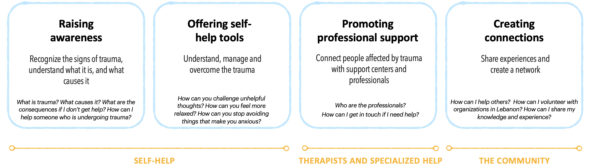
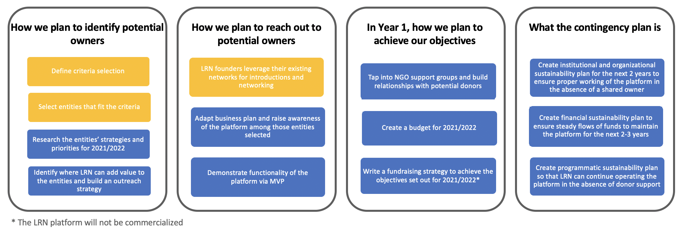

# Lebanon Relief Network

  

## Introduction

Welcome to Lebanon Relief Network. This README will serve as a high level guide for how to contribute to the project

1. [Introduction](#introduction)
1. [Project Description](#project-description)
1. [Team](#team)
1. [Live Site URLs](#live-site-urls)
1. [Cloud Architecture](#cloud-architecture)
1. [Directory Structure](#directory-structure)
1. [Available Scripts](#available-scripts)
1. [Key Links](#key-links)

This project was bootstrapped with [Create React App](https://github.com/facebook/create-react-app).

## Project Description

A traumatic event like the Beirut explosion of August, 4th is bound to have repercussions on the mental health of those directly and indirectly affected. UNICEF estimates that 600,000 children could be in need of psychosocial support.

The mission of the Lebanon Relief Network is to raise awareness and connect individuals affected by trauma with mental health support networks, independently of religious views and political affiliations.

The Lebanon Relief Network platform will:

- Connect individuals suffering from trauma - inside and outside Lebanon - with local and international trauma relief organizations, independent professionals, and volunteers.
- Raise awareness and create a forum for professionals working in the field of psychotrauma to share ideas and knowledge relevant to their work in the field.

The Lebanon Relief Network focusses on help requests and offers related to trauma, and effects of trauma on mental health.

The platform will address:

- Lebanese citizens that were affected by the explosion on August, 4th, 2020
- Individuals outside of Lebanon that were affected by the event (Lebanese diaspora)
- Associations, organizations, NGOs, academic institutions and experts with specific psychotrauma experience
- International Volunteers

#### Sustainability Plan

LRN founders are dedicated to their mission of raising awareness and connecting individuals affected by trauma with mental health support networks.
After the initial development and hosting provided by IBM and IBM Corporate Social Responsibility, we plan to offer part ownership of the platform to organizations whose missions complement that of LRN. In parallel, we will be working on a contingency plan to fully sustain the platform until such partnership(s) are concluded.

## Teams

We are a group international volunteers, working in design and development.

### Designers

- [Lama Halwaji](https://www.linkedin.com/in/lamahalwaji/)
- [Kira Madsen Lorenzen](https://www.linkedin.com/in/kiramlo/)
- [Mia Chkaibane](https://www.linkedin.com/in/mia-chkaibane-a8905364/)
- [Milly Longbottom](https://www.linkedin.com/in/milly-longbottom/)

### Developers

- [Antonio D'aria](https://www.linkedin.com/in/antonio-d-aria-59383046/)
- [Emily Ransley](https://www.linkedin.com/in/emily-ransley-77bb54b7/)
- [Matej Ocovsky](https://www.linkedin.com/in/matej-ocovsky-63322ab5/)
- [Nick Morgan](https://www.linkedin.com/in/nick-morgan-30301a82/)
- [Piers Walter](https://www.linkedin.com/in/piers-walter/)
- [Sanchit Sharma](https://puppykit.org.uk/)
- [Tom Madelin](https://www.linkedin.com/in/tom-madelin-4bb510147/)
- [Zack Dove](https://www.linkedin.com/in/zack-dove-533ab692/)

### Architects

- [Brian Say](https://www.linkedin.com/in/brian-say/)
- [Claudio Tag](https://www.linkedin.com/in/claudiotagliabue)
- [Steve Arnold](https://www.linkedin.com/in/sarnoldatwork/)

## Live site URLs

- Dev app: https://lrn-dev-2.eu-de.mybluemix.net/
- Test app: https://lrn-test-2.eu-de.mybluemix.net/

## Cloud Architecture

The solution is a web-based platform.

- The front and back ends are coded primarily in Node.JS / React
- Data and metadata stores use Cloudant
- Content is stored in Object Storage
- Personal and Sensitive Information is encrypted at rest
- Email notifications and calendar invites are sent via SMTP

### IBM Cloud Services

- [IBM Cloud Foundry](https://cloud.ibm.com/cloudfoundry/overview)
- [IBM Toolchain](https://cloud.ibm.com/devops/create)
- [IBM Cloudant](https://cloud.ibm.com/catalog/services/cloudant)
- [IBM Cloud Object Storage](https://cloud.ibm.com/catalog/services/cloud-object-storage)
- [IBM Watson Discovery](https://cloud.ibm.com/catalog/services/discovery)
- [IBM Key Protect](https://cloud.ibm.com/catalog/services/key-protect)
- [Sendgrid](https://cloud.ibm.com/catalog/infrastructure/email-delivery)

## Available Scripts

In order to run the backend locally you need to export the VCAP_SERVICES environment variable which can be found in the team slack channel.

After you have done this in the project directory, you can run:

### `npm run install_all`

Installs packages in both server and web-app

### `npm run build && npm start`

Runs the server 
Open [http://localhost:3000](http://localhost:3000) to view it in the browser.

To make edits to the React app you will need to run the server and the app using the following command

### `npm run dev`

The page will reload if you make edits to the code inside `web-app` folder. 
You will also see any lint errors in the console.

### `npm test`

Launches the test runner in the interactive watch mode for the express server. 

### `cd web-app && npm test`

Launches the test runner in the interactive watch mode for the react app. 
See the section about [running tests](https://facebook.github.io/create-react-app/docs/running-tests) for more information.

### `npm run build`

Builds the app for production to the `dist` folder. 
It correctly bundles React in production mode and optimizes the build for the best performance.

The build is minified and the filenames include the hashes. 
Your app is ready to be deployed!

See the section about [deployment](https://facebook.github.io/create-react-app/docs/deployment) for more information.

## Version

v0.1

## License

This project is licensed under the Apache 2 License - see the [LICENSE](LICENSE) file for details
