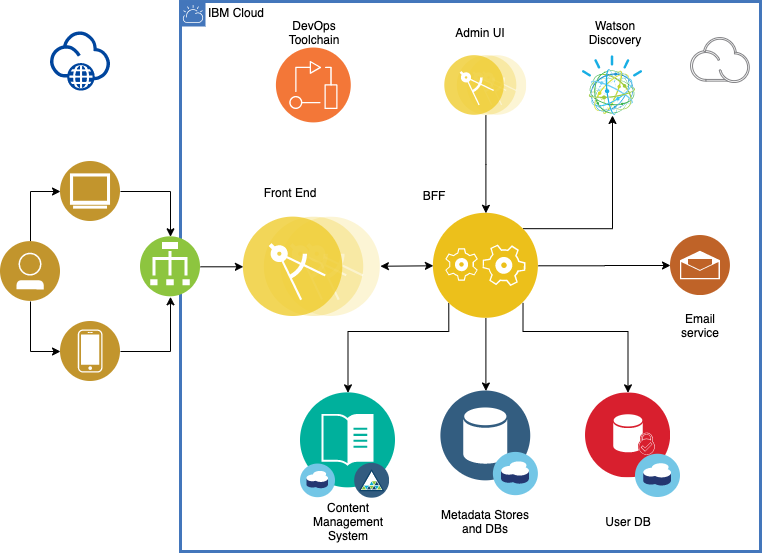

# Lebanon Relief Network


[](https://www.apache.org/licenses/LICENSE-2.0) [](https://callforcode.org/slack) [](https://al-wasal-connect.eu-gb.mybluemix.net/)

## Intro

Welcome to Lebanon Relief Network. This README will serve as a high level guide for how to contribute to the project.

- [Project Description](#project-description)
- [Project Team](#project-team)
- [Live Site URLs](#live-site-urls)
- [Cloud Architecture](#cloud-architecture)
- [Directory Structure](#directory-structure)
- [Available Scripts](#available-scripts)
- [Git Commit Convention](#git-commit-convention)
- [Key Links](#key-links)

This project was bootstrapped with [Create React App](https://github.com/facebook/create-react-app).

## Project Description

A traumatic event like the Beirut explosion of August, 4th is bound to have repercussions on the mental health of those directly and indirectly affected. UNICEF estimates that 600,000 children could be in need of psychosocial support.

The mission of the Lebanon Relief Network is to raise awareness and connect individuals affected by trauma with mental health support networks, independently of religious views and political affiliations.

The Lebanon Relief Network platform will:
- Connect individuals suffering from trauma - inside and outside Lebanon - with local and international trauma relief organizations, independent professionals, and volunteers.
- Raise awareness and create a forum for professionals working in the field of psychotrauma to share ideas and knowledge relevant to their work in the field.

The Lebanon Relief Network focusses on help requests and offers related to trauma, and effects of trauma on mental health.

The platform will address:
- Lebanese citizens that were affected by the explosion on August, 4th, 2020
- Individuals outside of Lebanon that were affected by the event (Lebanese diaspora)
- Associations, organizations, NGOs, academic institutions and experts with specific psychotrauma experience
- International Volunteers

## Project Team

tbd

## Live site URLs

tbd

## Cloud Architecture

The solution is a web-based platform.
- The front and back ends are coded primarily in Node.JS / React
- Data and metadata stores use Cloudant
- Content is stored in Object Storage
- Personal and Sensitive Information is encrypted at rest
- Email notifications and calendar invites are sent via SMTP



### IBM Cloud Services
* [IBM Cloud Foundry](https://cloud.ibm.com/cloudfoundry/overview)
* [IBM Toolchain](https://cloud.ibm.com/devops/create)
* [IBM Cloudant](https://cloud.ibm.com/catalog/services/cloudant)
* [IBM Cloud Object Storage](https://cloud.ibm.com/catalog/services/cloud-object-storage)
* [IBM Watson Discovery](https://cloud.ibm.com/catalog/services/discovery)
* [IBM Key Protect](https://cloud.ibm.com/catalog/services/key-protect)
* [Sendgrid](https://cloud.ibm.com/catalog/infrastructure/email-delivery)

## Directory Structure

tbd

## Available Scripts

In the project directory, you can run:

### `yarn start`

Runs the app in the development mode.<br />
Open [http://localhost:3000](http://localhost:3000) to view it in the browser.

The page will reload if you make edits.<br />
You will also see any lint errors in the console.

### `yarn test`

Launches the test runner in the interactive watch mode.<br />
See the section about [running tests](https://facebook.github.io/create-react-app/docs/running-tests) for more information.

### `yarn build`

Builds the app for production to the `build` folder.<br />
It correctly bundles React in production mode and optimizes the build for the best performance.

The build is minified and the filenames include the hashes.<br />
Your app is ready to be deployed!

See the section about [deployment](https://facebook.github.io/create-react-app/docs/deployment) for more information.

### `yarn eject`

**Note: this is a one-way operation. Once you `eject`, you can’t go back!**

If you aren’t satisfied with the build tool and configuration choices, you can `eject` at any time. This command will remove the single build dependency from your project.

Instead, it will copy all the configuration files and the transitive dependencies (webpack, Babel, ESLint, etc) right into your project so you have full control over them. All of the commands except `eject` will still work, but they will point to the copied scripts so you can tweak them. At this point you’re on your own.

You don’t have to ever use `eject`. The curated feature set is suitable for small and middle deployments, and you shouldn’t feel obligated to use this feature. However we understand that this tool wouldn’t be useful if you couldn’t customize it when you are ready for it.

## Git Commit Convention

The following is the recommended and preferred format for git commit messages:

### Commit Message Format

Each commit message starts with a type, a scope, and a subject.

Below that, the commit message has a body:

- **type**: what type of change this commit contains.
- **scope**: what item of code this commit is changing.
- **subject**: a short description of the changes.
- **body** (optional): a more in-depth description of the changes, only if required

```
<type>(<scope>): <subject>
<BLANK LINE>
<body>
```

### Type

Is recommended to be one of the below items:

- **feat**: A new feature
- **fix**: A bug fix
- **docs**: Documentation only changes e.g. README
- **style**: Changes that do not affect the meaning of the code (white-space, formatting, missing semi-colons, etc)
- **refactor**: A code change that neither fixes a bug or adds a feature
- **test**: Adding missing tests
- **chore**: Changes to the build process or auxiliary tools and libraries such as documentation generation e.g. package dependencies, webpack changes, etc.

### Scope

The scope could be anything specifying the place of the commit change. For example `$location`, `$browser`, `$compile`, `$rootScope`, `ngHref`, `ngClick`, `ngView`, etc...

### Subject

The subject contains succinct description of the change:

- use the imperative, present tense: "change" not "changed" nor "changes"
- don't capitalize first letter
- no dot (.) at the end

## Key Links

tbd

## Version

v0.1

## License

This project is licensed under the Apache 2 License - see the [LICENSE](LICENSE) file for details
